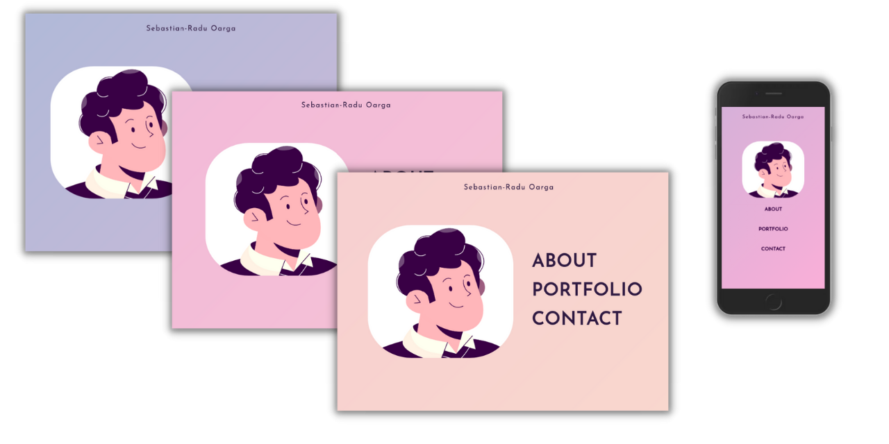
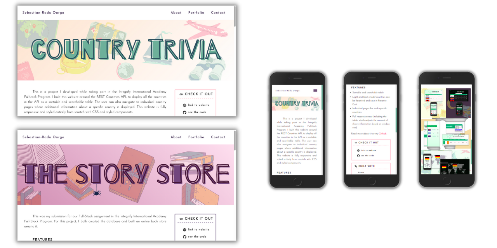

<h1 align="center">My Developer Portolio</h1>

## Table of contents

- [Description](#description)
- [Features](#features)
- [Built with](#built-with)
- [Styled with](#styled-with)
- [Author](#author)

### Description

I built this website to introduce myself and some of my work. Keeping this in mind, I tried to use design as a language and give the visitor a feeling of what I'm like as a person and as a developer even before they can navigate to the About page or the individual project pages.

Therefore, I allowed myself to be creative and playful in styling the webpage, using cheerful color combinations and subtle animations, to prove, in addition to my full-stack developer skills, my attention to detail and eye for design and pleasing aesthetics.

### Features

- animated, color-changing background
- carousel structure (sliding pages)
- individual project presentation pages
- fully responsive

### Links

- Live Site URL: [Sebastian-Radu Oarga](http://sebastianraduoarga.com)

### Built with

- [React](https://reactjs.org/)
- [Typescript](https://www.typescriptlang.org/)

### Styled with

- CSS
- [Styled Components](https://styled-components.com/)

## Author

<!-- - Website - [Sebastian-Radu Oarga](to be added) -->

- Website - [Sebastian-Radu Oarga](http://www.sebastianraduoarga.com)
- LinkedIn - [Sebastian-Radu Oarga](https://www.linkedin.com/in/sebastianoarga/)
